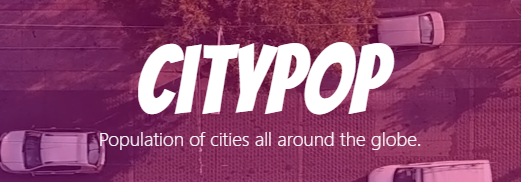

## `Background`
Citypop is a web-application that enables searching for population by city or the most populated cities in a country. It was built with [ReactJS](https://reactjs.org/) and initiated with [Create React App](https://github.com/facebook/create-react-app). [NodeJS](https://nodejs.org/en/) was heavily used with it's package manager to install libraries as [GreenSock](https://greensock.com/react/) and [React Router](https://reactrouter.com/).

## `Architecture`
The structure of the code is heavily influenced by the standards of ReactJS. The application is based on components. Majority of the source code is built with React's functional components that accepts props and returns a reusable component. Some of them that requires state management uses hooks to accomplish that. A better distinction between view-components and container-components could and should be made in the future. 

## `Open development environment`
Make sure latest version of NodeJS, npm and npx is installed with the commands:
```bash
node -v
npm -v
npx -v
```
Navigate to the top-directory of the project:
```bash
cd <path>/citypop
```
Start a local server with the command:
```bash
npm start
```
It should open a window in your browser with the running application.

If you use visual studio code as integrated development environment, you can open a new command-prompt, navigate to the top-directory and write:
```bash
code .
```
It will open visual studio in the right directory. If you use another ide, please open the folder citypop to open the project.

